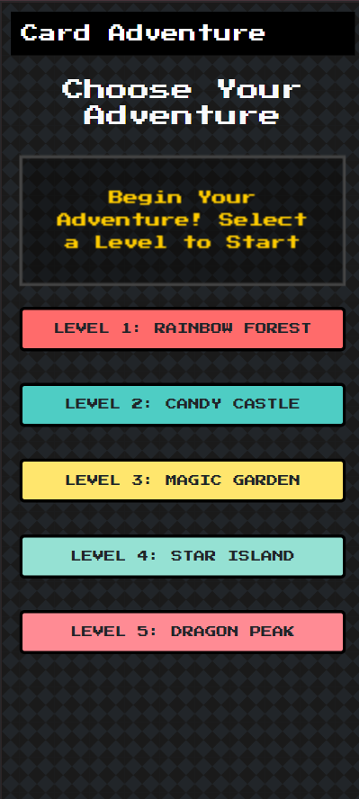

# 武器大蒐集 (Weapon Collection Game)

一個充滿復古像素風格的互動式卡牌收集網頁應用程式，具有精美的視覺效果和流暢的使用者體驗。

| 嗨  | 收集  | 收集完了 |
|----------|----|----|
| |  |  |

## 👥 作者與貢獻者

- **發想與概念**: @ncc
- **技術實現**: @Cursor AI Assistant

## 🌟 特色功能

### 遊戲機制
- 5個獨特的關卡主題
- 每個關卡包含2張精美的卡牌
- 玩家可以從每個關卡中選擇並收集卡牌
- 關卡進度追蹤和完成度顯示

### 關卡名稱對照
| 關卡 | 中文名稱 | 英文名稱 | 參與者 |
|------|----------|----------|---------|
| 1 | 祠堂前空地 | Temple Square | 秉均、怡辰 |
| 2 | 道場前空地 | Dojo Plaza | 叉聲、承佑 |
| 3 | 道場一樓 | Dojo Hall | 文日、睿宏 |
| 4 | 車棚後空地 | Carport Garden | 冠芸、翊睿 |
| 5 | 車棚 | Carport Corner | 鼎宏、子芸 |

### 視覺設計
- 復古像素風格的UI設計
- 流暢的動畫效果
- 精心設計的配色方案
- 響應式布局，適配各種螢幕尺寸
- 統一的卡牌尺寸和背景

### 互動特效
- 卡牌選擇時的縮放動畫
- 關卡解鎖的滑入動畫
- 收集完成時的脈動效果
- 觸控優化的操作體驗

### 技術特點
- PWA (Progressive Web App) 支援
  - 可安裝到主屏幕
  - 離線工作能力
  - iOS Safari 完整支援
  - 自動更新檢測
- 離線功能支援
  - 網路優先策略
  - 智能快取管理
  - 離線狀態提示
- 本地數據存儲
- 觸控和滑鼠事件優化
- 無障礙性支援

## 🛠 使用技術

### 前端框架與庫
- HTML5
- CSS3 (使用現代CSS特性)
- JavaScript (原生ES6+)
- Bootstrap 5 (UI框架)

### 特殊功能實現
- CSS Grid 用於卡牌布局
- LocalStorage 用於數據持久化
- Service Worker 用於離線功能
- Intersection Observer API 用於滾動動畫
- Touch Events API 用於移動端優化

### 設計特性
- Press Start 2P 字體用於像素風格
- CSS 動畫和過渡效果
- 響應式設計
- 深色主題

### 圖片處理工具
- Python 圖片處理腳本
  - 自動調整圖片尺寸
  - 智能背景填充
  - 保持圖片比例
  - 自動備份原始圖片

## 💡 特色亮點

1. **無縫離線體驗**
   - 使用 Service Worker 實現離線功能
   - 本地數據���儲確保遊戲進度不丟失
   - 智能的網路優先策略
   - 版本更新自動提示

2. **優化的移動端體驗**
   - 觸控優化的操作方式
   - 響應式設計適配各種螢幕
   - 流暢的動畫效果
   - iOS 完整支援

3. **精美的視覺設計**
   - 像素風格的一致性
   - 動態的視覺反饋
   - 細緻的動畫效果
   - 統一的卡牌展示效果

4. **無障礙性支援**
   - ARIA 標籤支援
   - 鍵盤導航支援
   - 高對比度模式支援

## 🎮 使用說明

1. 進入遊戲後，您會看到五個不同主題的關卡
2. 點擊任意關卡按鈕來選擇卡牌
3. 在彈出的對話框中選擇您喜歡的卡牌
4. 收集的卡牌會顯示在頂部的收藏區
5. 點擊收藏的卡牌可以全螢幕查看
6. 右上角有隱藏的重置功能（連續點擊三次）
7. 支援安裝為桌面應用（PWA）

## 🔧 開發工具

### PWA 功能
- 可安裝到主屏幕
- 離線工作能力
- 快取策略優化
- 自動更新機制

### 性能優化
- 圖片延遲加載
- 動畫性能優化
- 觸控事件節流
- 圖片尺寸優化

### 開發工具
- Python 圖片處理工具
  - 自動調整圖片尺寸
  - 智能填充背景
  - 批量處理功能
  - 原圖備份功能

## 📱 支援平台
- 現代瀏覽器 (Chrome, Firefox, Safari, Edge)
- iOS 和 Android 移動設備
- 平板電腦
- 桌面電腦

## 🔜 未來展望
- 新增更多關卡和卡牌
- 添加卡牌特效和動畫
- 實現卡牌收藏冊功能
- 加入社交分享功能
- 支援多語言

## 📝 授權
本項目採用 MIT 授權條款